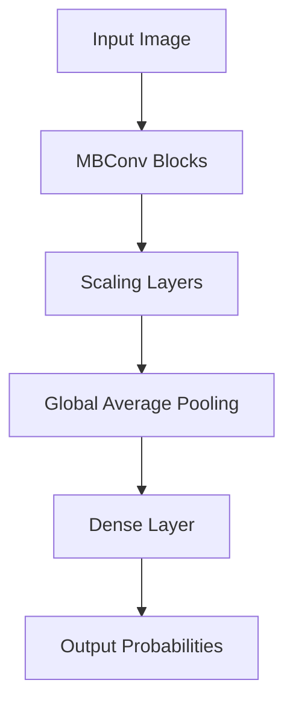
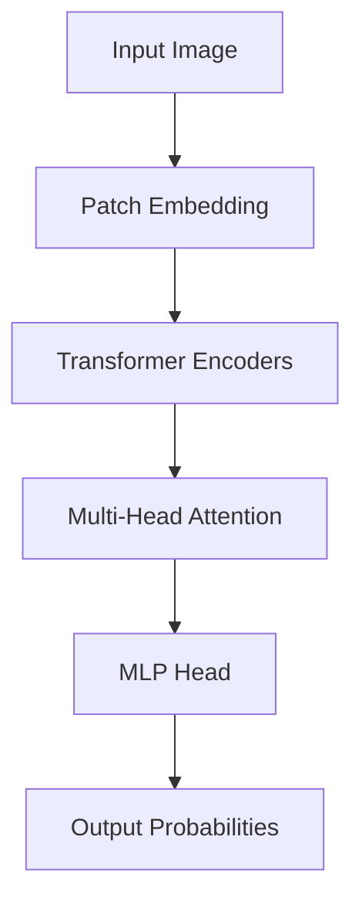
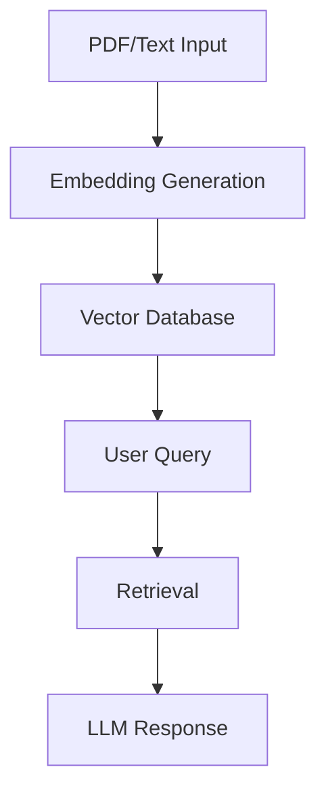

# NeuroLens

## Abstract
NeuroLens is an advanced computer vision and Retrieval-Augmented Generation (RAG) system designed for domain-specific research and analysis. By leveraging an ensemble of EfficientNet-B4 and Vision Transformer (ViT) models for image classification and analysis, and integrating a RAG pipeline for context-aware querying, NeuroLens provides a robust solution for research-driven applications.

---

## Key Features

- **Vision Ensemble**: Combines EfficientNet-B4 and ViT-Base for enhanced image classification accuracy. The ensemble logic uses weighted averaging of predictions to leverage the strengths of both architectures.
- **RAG Pipeline**: Integrates LangChain with a vector database for efficient retrieval of domain-specific research context. Supports ingestion of PDFs and text documents for embedding and querying.
- **Tech Stack**: Built with Python, FastAPI, PyTorch, Albumentations, SQLAlchemy, and PostgreSQL for a scalable and efficient system.

---

## System Architecture

### EfficientNet-B4


### Vision Transformer (ViT)


### RAG System Flow


---

## Installation

### Using `pip`
```bash
pip install -e .
```

### Conda Environment Setup
```bash
conda create -n neurolens python=3.9
conda activate neurolens
pip install -r requirements.txt
```

---

## API Documentation

### FastAPI Endpoints

- **`/inference`**: Perform image classification using the vision ensemble.
- **`/query`**: Submit a query to the RAG pipeline for context-aware responses.

---

## License

This project is licensed under the MIT License. See the LICENSE file for details.