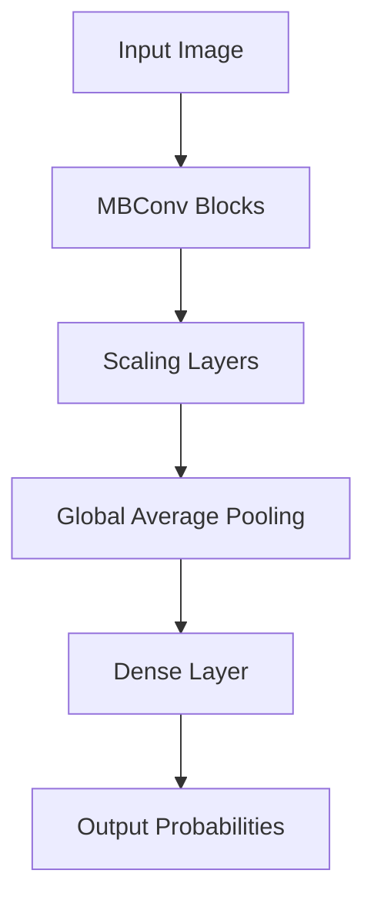
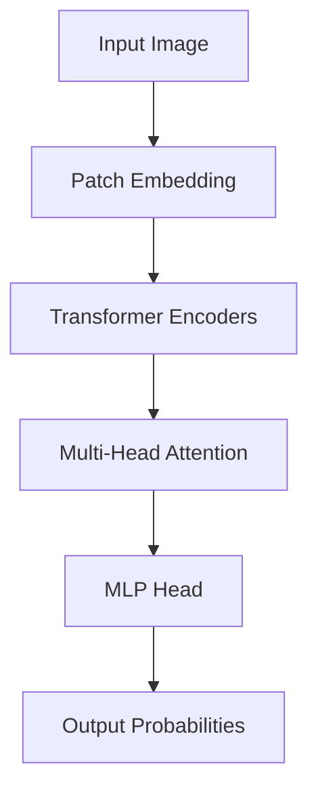
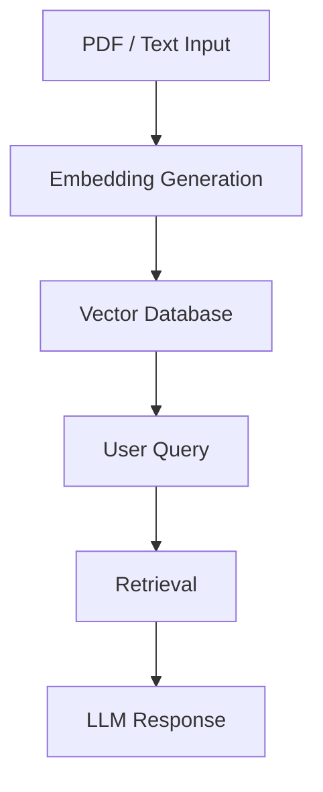
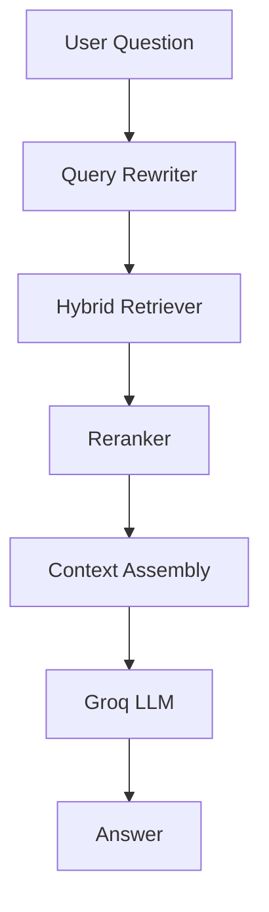
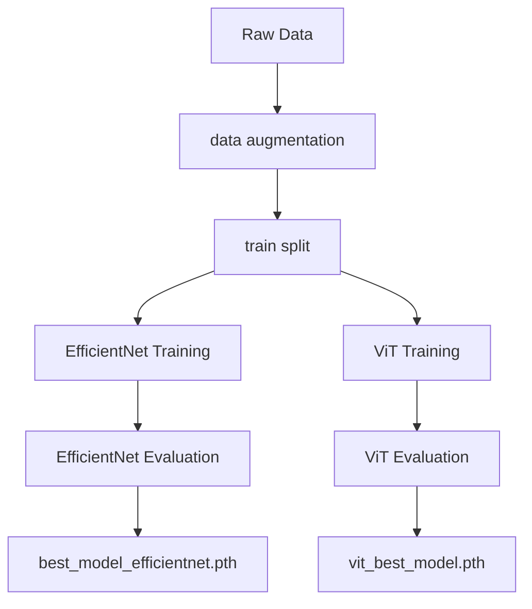

# NeuroLens

## Abstract

NeuroLens is an advanced computer vision and Retrieval-Augmented Generation (RAG) system designed for domain-specific research and analysis. It leverages an ensemble of EfficientNet-B4 and Vision Transformer (ViT) models for image classification, and integrates a RAG pipeline for context-aware querying — providing a robust, scalable solution for research-driven applications. This project specifically focuses on brain tumor classification, utilizing state-of-the-art deep learning models to assist in medical imaging analysis and diagnosis.

---

## Key Features

**Vision Ensemble** — Combines EfficientNet-B4 and ViT-Base for enhanced image classification accuracy. The ensemble uses weighted averaging of predictions to leverage the complementary strengths of both architectures.

**RAG Pipeline** — Integrates LangChain with a vector database for efficient retrieval of domain-specific research context. Supports ingestion of PDFs and text documents for embedding and querying.

**Brain Tumor Q&A Chat** — A dedicated RAG-based conversational assistant that answers general questions about brain tumor types, symptoms, and treatments. Operates independently of the vision models — no image upload required.

**DVC Pipeline** — All datasets and model training stages are version-controlled and reproducible via DVC. The full pipeline from data ingestion to model evaluation is defined in `dvc.yaml` and can be reproduced with a single command.

**Experiment Tracking** — Training runs for both EfficientNet-B4 and ViT are tracked with Weights & Biases (W&B), logging metrics, hyperparameters, and model checkpoints for comparison and reproducibility.

**Production-Ready Stack** — Built with Python, FastAPI, PyTorch, Albumentations, LangChain, and Streamlit for a modular, efficient, and scalable system.

---

## System Architecture

### EfficientNet-B4



### Vision Transformer (ViT)



### RAG System Flow



### Brain Tumor Q&A Chat Flow



### DVC Pipeline



---

## Brain Tumor Q&A Chat

NeuroLens includes a standalone conversational assistant for answering questions about brain tumors. It is powered by the same RAG pipeline used for scan explanations but operates independently — no MRI image is required.

### How it works

1. The user submits a natural language question via the Streamlit chat interface or the `/qna` API endpoint.
2. The query is rewritten into multiple focused search queries using an LLM.
3. Relevant document chunks are retrieved from the vector database using hybrid search.
4. A reranker selects the top 4 most relevant chunks.
5. The Groq LLM generates a concise, patient-friendly answer grounded in the retrieved context.

### Example questions

- What is a Glioma?
- What are the symptoms of Meningioma?
- How is a Pituitary Tumor treated?
- Are brain tumors hereditary?
- What is the difference between benign and malignant brain tumors?

### API endpoint

```
POST /qna
Content-Type: application/json

{
  "message": "What are the symptoms of Glioma?"
}
```

Response:
```json
{
  "reply": "Glioma can cause headaches, seizures, memory problems..."
}
```

---

## DVC — Data and Pipeline Versioning

All datasets and trained models are tracked with [DVC](https://dvc.org). This ensures full reproducibility of every training run and prevents large binary files from being committed to Git.

### What is tracked

| Tracked by DVC | Tracked by Git |
|---|---|
| `data/augmented/` | `dvc.yaml` |
| `data/splits/` | `dvc.lock` |
| `models/efficientnet_models/` | `.dvc` pointer files |
| `models/vit_models/` | All source code |

### Reproducing the full pipeline

```bash
# Run all stages defined in dvc.yaml
dvc repro
```

DVC automatically detects which stages are out of date and only reruns what has changed.

### Pulling data and models

```bash
# Get latest data and models from remote storage
dvc pull
```

### Pushing after training

```bash
# Save new models and data to remote storage
dvc push
```

### Daily workflow

```bash
# Start of day
git pull
dvc pull

# After training a new model
dvc push
git add dvc.lock
git commit -m "update model after training run"
git push
```

> **Important:** Always run `dvc push` before `git push` to keep model files and code pointers in sync.

---

## Experiment Tracking with Weights & Biases

All training runs for EfficientNet-B4 and ViT are logged to [Weights & Biases](https://wandb.ai) for experiment tracking and comparison.

### What is logged

| Category | Details |
|---|---|
| Hyperparameters | Learning rate, batch size, epochs, optimizer, scheduler |
| Metrics | Train loss, validation loss, accuracy, F1 score per epoch |
| Model checkpoints | Best model saved and logged as W&B artifacts |
| Confusion matrices | Per-class performance visualized after evaluation |
| System info | GPU utilization, memory usage per run |

### Setup

Add your W&B API key to `.env`:

```env
WANDB_API_KEY=your_wandb_key
```

### Viewing runs

All runs are available at `https://wandb.ai/your-username/neurolens`. You can compare runs, plot metrics side by side, and reproduce any past configuration directly from the W&B dashboard.

---

## Installation

### Standard (pip)

```bash
pip install -e .
```

### Conda Environment

```bash
conda create -n neurolens python=3.9
conda activate neurolens
pip install -r requirements.txt
```

---

## Environment Variables

Create a `.env` file in the project root with the following keys:

```env
GROQ_API_KEY=your_groq_api_key
HUGGINGFACEHUB_API_TOKEN=your_huggingface_token
WANDB_API_KEY=your_wandb_key
```

Never commit this file to version control.

---

## API Reference

NeuroLens exposes the following REST endpoints via FastAPI:

| Endpoint | Method | Description |
|---|---|---|
| `/analyze-image/{model}` | `POST` | Classify a brain MRI scan using a single model |
| `/analyze-and-explain/{model}` | `POST` | Classify scan and generate a RAG explanation |
| `/ensemble-voting` | `POST` | Classify using weighted ensemble of both models |
| `/ensemble-and-explain` | `POST` | Ensemble classification with RAG explanation |
| `/qna` | `POST` | Ask a general question about brain tumors (no image needed) |

Interactive API documentation is available at `http://localhost:8000/docs` when running locally.

---

## Tech Stack

| Category | Technologies |
|---|---|
| Vision Models | EfficientNet-B4, Vision Transformer (ViT) |
| Training & Augmentation | PyTorch, Torchvision, Albumentations |
| RAG & LLM | LangChain, LangChain-Groq, ChromaDB, Sentence Transformers |
| Chat System | Hybrid Retriever, Reranker, Query Rewriter, Groq LLM |
| API | FastAPI, Uvicorn |
| UI | Streamlit |
| Data & Pipeline Versioning | DVC |
| Experiment Tracking | Weights & Biases (wandb), Optuna |
| Utilities | OpenCV, Pillow, NumPy, scikit-learn, Matplotlib, Seaborn |