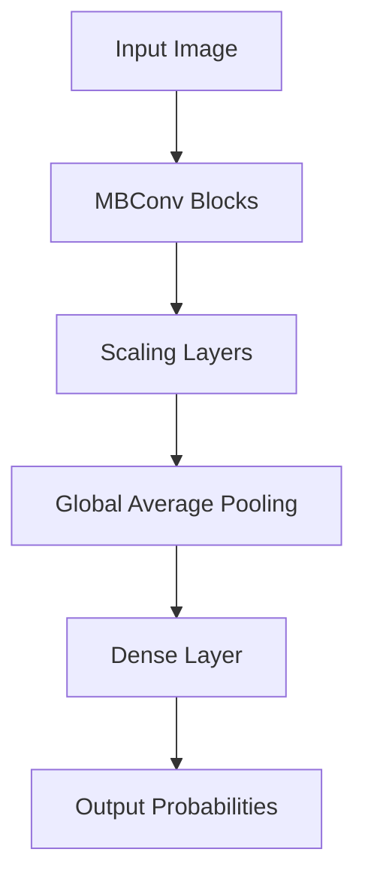
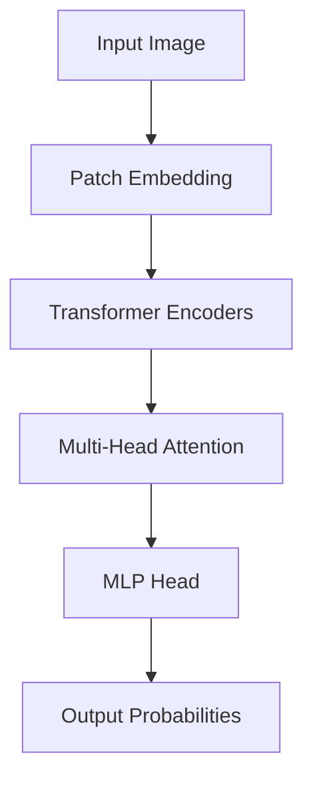
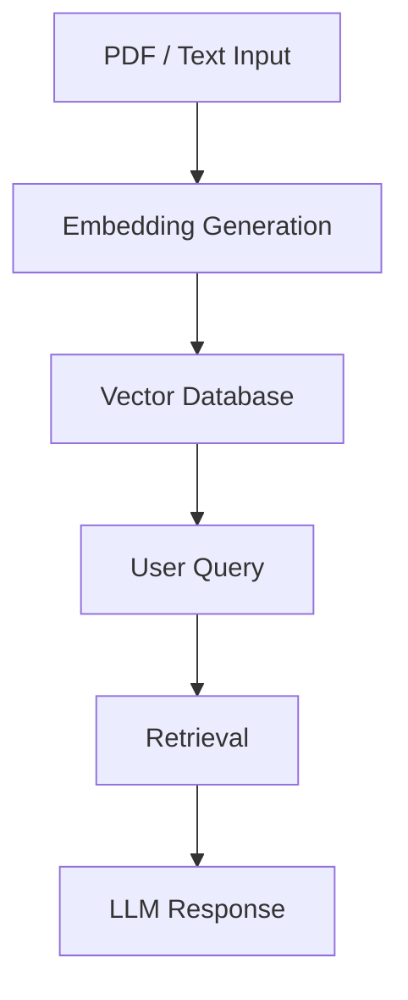

# NeuroLens

## Abstract

NeuroLens is an advanced computer vision and Retrieval-Augmented Generation (RAG) system designed for domain-specific research and analysis. It leverages an ensemble of EfficientNet-B4 and Vision Transformer (ViT) models for image classification, and integrates a RAG pipeline for context-aware querying — providing a robust, scalable solution for research-driven applications.

---

## Key Features

**Vision Ensemble** — Combines EfficientNet-B4 and ViT-Base for enhanced image classification accuracy. The ensemble uses weighted averaging of predictions to leverage the complementary strengths of both architectures.

**RAG Pipeline** — Integrates LangChain with a vector database for efficient retrieval of domain-specific research context. Supports ingestion of PDFs and text documents for embedding and querying.

**Production-Ready Stack** — Built with Python, FastAPI, PyTorch, Albumentations, LangChain, and Streamlit for a modular, efficient, and scalable system.

---

## System Architecture

### EfficientNet-B4



### Vision Transformer (ViT)



### RAG System Flow



---

## Installation

### Standard (pip)

```bash
pip install -e .
```

### Conda Environment

```bash
conda create -n neurolens python=3.9
conda activate neurolens
pip install -r requirements.txt
```

---

## Environment Variables

Create a `.env` file in the project root with the following keys:

```env
GROQ_API_KEY=your_groq_api_key
HUGGINGFACEHUB_API_TOKEN=your_huggingface_token
WANDB_API_KEY=your_wandb_key
```

Never commit this file to version control.

---

## API Reference

NeuroLens exposes the following REST endpoints via FastAPI:

| Endpoint | Method | Description |
|---|---|---|
| `/inference` | `POST` | Perform image classification using the vision ensemble |
| `/query` | `POST` | Submit a query to the RAG pipeline for context-aware responses |

Interactive API documentation is available at `http://localhost:8000/docs` when running locally.

---

## Deployment

NeuroLens is configured for deployment on Hugging Face Spaces using Docker. The application runs Streamlit on port `7860` and FastAPI on port `8000`.

To deploy, push all project files including `Dockerfile`, `start.sh`, and `requirements.txt` to your Space repository. Add all environment variables under Settings > Repository Secrets.

---

## Tech Stack

| Category | Technologies |
|---|---|
| Vision Models | EfficientNet-B4, Vision Transformer (ViT) |
| Training & Augmentation | PyTorch, Torchvision, Albumentations |
| RAG & LLM | LangChain, LangChain-Groq, ChromaDB, Sentence Transformers |
| API | FastAPI, Uvicorn |
| UI | Streamlit |
| Experiment Tracking | Weights & Biases (wandb), Optuna |
| Utilities | OpenCV, Pillow, NumPy, scikit-learn, Matplotlib, Seaborn |

---

